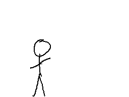
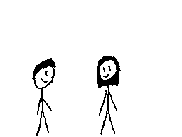
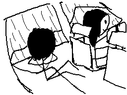

GIF por sus siglas en inglés (Graphics Interchange Format) es un estándar que
define "imágenes rasterizadas de color generalizadas" que son básicamente
imágenes formadas por puntos llamados pixeles, donde además, cada pixel tiene un
valor de color \[[1][1]\] \[[2][2]\].

<!-- Seguir leyendo -->

También, el formato GIF soporta animaciones, y aunque tiene limitaciones (no
permite gradientes de colores), funciona muy bien para gráficos simples como
logotipos o gráficos con áreas de color solido.

Después de esa brevísima introducción, les contaré una historia.

Érase una vez un vato al que le gustaba mucho hacer gifs.

Aquí algunos de los que llegó a dibujar:

  

    

    

    

      Siendo empujado por el aire
    

  

  

    

    

    

      Regalando una flor
    

  

  

    

    

    

      Cabeza de palomita
    

  

  

    

    

    

      Escuchando música en el auto
    

  

  

    

    

    

      Sandwich bailarín
    

  

  

    

    

    

      Pensando
    

  

[1]: https://www.w3.org/Graphics/GIF/spec-gif87.txt
[2]: https://support.99designs.com/hc/es/articles/204761835--Qué-son-los-vectores-y-las-imagenes-rasterizadas-Cuándo-debería-usarlas-
