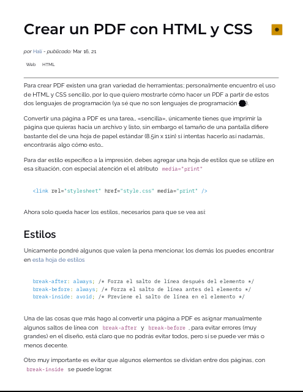
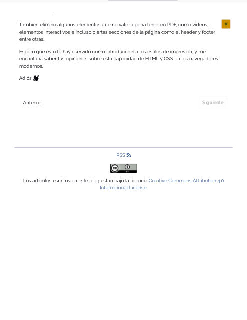
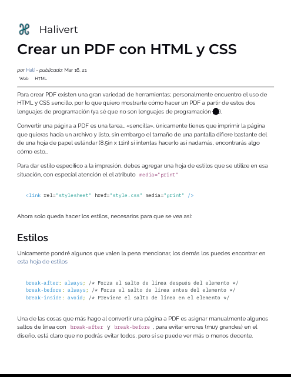
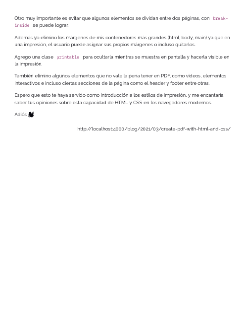

Para crear PDF existen una gran variedad de herramientas; personalmente
encuentro el uso de HTML y CSS sencillo, por lo que quiero mostrarte cómo hacer
un PDF a partir de estos dos lenguajes de programación<!-- Seguir leyendo -->
(ya sé que no son lenguajes de programación 😂).

Convertir una página a PDF es una tarea... «sencilla», únicamente tienes que
imprimir la página que quieras hacia un archivo y listo, sin embargo el tamaño
de una pantalla difiere bastante del de una hoja de papel estándar
(8.5in x 11in) si intentas hacerlo así nadamás, encontrarás algo cómo esto...

<div class="flex gap-3">
  <div class="flex-1">



  </div>
  <div class="flex-1">



  </div>
</div>

Para dar estilo específico a la impresión, debes agregar una hoja de estilos que
se utilize en esa situación, con especial atención al atributo
`media="print"`

```html
<link rel="stylesheet" href="style.css" media="print" />
```

Ahora solo queda hacer los estilos, necesarios para que se vea así:

<div class="flex gap-3">
  <div class="flex-1">



  </div>
  <div class="flex-1">



  </div>
</div>

<h2 id="styles">Estilos</h2>

Unicamente pondré algunos que valen la pena mencionar, los demás los puedes
encontrar en [esta hoja de estilos][1]

```css
break-after: always; /* Forza el salto de línea después del elemento */
break-before: always; /* Forza el salto de línea antes del elemento */
break-inside: avoid; /* Previene el salto de línea en el elemento */
```

Una de las cosas que más hago al convertir una página a PDF es asignar
manualmente algunos saltos de línea con [`break-after`][2] y
[`break-before`][3], para evitar errores (muy grandes) en el diseño, está claro
que no podrás evitar todos, pero sí se puede ver más o menos decente.

Otro muy importante es evitar que algunos elementos se dividan entre dos
páginas, con [`break-inside`][4] se puede lograr.

Además yo elimino los márgenes de mis contenedores más grandes (html, body,
main) ya que en una impresión, el usuario puede asignar sus propios márgenes o
incluso quitarlos.

Agrego una clase `printable` para ocultarla mientras se muestra en pantalla y
hacerla visible en la impresión.

También elimino algunos elementos que no vale la pena tener en PDF, como videos,
elementos interactivos e incluso ciertas secciones de la página como el header y
footer entre otras.

Espero que esto te haya servido como introducción a los estilos de impresión, y
me encantaría saber tus opiniones sobre esta capacidad de HTML y CSS en los
navegadores modernos.

Adiós 👋🏽

[1]: /css/print.css
[2]: https://developer.mozilla.org/en-US/docs/Web/CSS/break-after
[3]: https://developer.mozilla.org/en-US/docs/Web/CSS/break-before
[4]: https://developer.mozilla.org/en-US/docs/Web/CSS/break-inside
