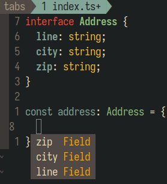

Llevo como 9 meses trabajando con Angular y es una historia graciosa porque me
habían contratado para escribir React.

Pero aunque al principio no estaba muy emocionado por pasar más de 1 mes en el
proyecto, lo cierto es que me ha gustado mucho.

<!-- Seguir leyendo -->

No considero que Angular sea el mejor framework para hacer frontend (me gusta
mucho más Vue.js) sin embargo hay algunas cosas que sí me gustan de Angular:

## Typescript

Angular utiliza extensamente Typescript y es mi cosa favorita de este framework.
Usar este lenguaje de programación hace que la experiencia en el desarrollo sea
más agradable, ya que utilizando un LSP (Language Server Provider) tu editor de
texto o IDE pueden proveer autocompletado sumamente útil.



En esta imagen se puede ver un autocompletado sencillo, aunque cuando agregas
interfaces, clases, genéricos la cosa se pone bastante buena.

## RxJS

Es una biblioteca que sirve para utilizar observables y hacer algo de
programación reactiva, me agrada porque en frontend muchas veces hay que pensar
en eventos y cómo reacciona la aplicación a ellos. Además RxJS permite tener un
estado global que permite mantener todo en orden con reducers y effects.

## Forms

Me agrada la manera en que Angular maneja los formularios, pueden estar tipados,
tiene la opción de validar y también de desactivar algunos campos.

```ts
constructor(private fb: FormBuilder) {
  this.form = this.fb.group({
    line: this.fb.nonNullable.control('', {
      validators: [Validators.required]
    }),
    city: this.fb.nonNullable.control('', {
      validators: [Validators.required]
    }),
  });
}
```

Con un formulario sencillo como ese, podemos obtener validación del formulario:

```ts
this.form.valid
```

También tenemos acceso a los controles y podemos desactivarlos
programaticamente:

```ts
this.form.controls.line.disable()
```

La forma en la que se utilizan los campos en los templates también es amigable:

```html
<form [formGroup]="form">
  <input formControlName="line" />

  <input formControlName="city" />

  <button [disabled]="form.invalid">Save</button>
</form>
```

## Testing

Aunque no es específico de Angular, comencé a utilizar jest con este proyecto y
al tratarse de una aplicación con RxJS también aprendí algo de testing con
marbles, que aunque fue complicado de aprender al inicio, resulta funcional y
confiable.

## Conclusión

Aunque Angular sigue (y seguramente seguirá) sin ser mi framework de confianza,
es una herramienta muy útil de la que he aprendido mucho y espero seguir
aprendiendo.
